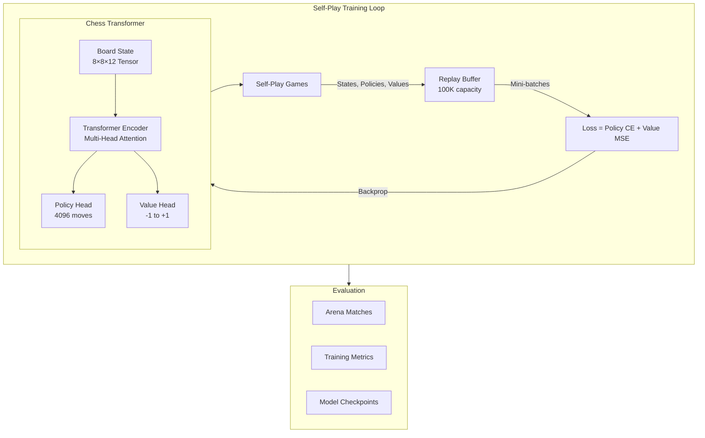

# chess_reinforce ♟️🧠

[](https://github.com/krishnakumarbhat/chess_reinforce/actions/workflows/ci.yml)
[](https://python.org)
[](https://pytorch.org)

A **Chess AI** built from scratch using **Transformer architecture** and **Reinforcement Learning** (self-play). The model learns chess through iterative self-play and improves via policy gradient methods — inspired by AlphaZero.

## 🏗️ Architecture



## 🔄 Training Pipeline

```mermaid
sequenceDiagram
    participant SP as Self-Play
    participant BUF as Replay Buffer
    participant MODEL as Transformer
    participant OPT as Optimizer

    loop Every Batch (10 games)
        SP->>SP: Play 10 self-play games
        SP->>BUF: Store (state, policy, value)
        loop 100 training steps
            BUF->>MODEL: Sample mini-batch (32)
            MODEL->>MODEL: Forward pass
            MODEL->>OPT: Policy + Value loss
            OPT->>MODEL: Update weights
        end
    end
    MODEL->>MODEL: Save checkpoint
```

## 🛠️ Tech Stack

| Component     | Technology                  |
| ------------- | --------------------------- |
| Deep Learning | PyTorch                     |
| Architecture  | Transformer (custom)        |
| RL Algorithm  | Self-Play + Policy Gradient |
| Chess Engine  | python-chess                |
| Visualization | Matplotlib                  |
| Logging       | Python logging + JSON       |

## 🚀 Quick Start

```bash
# Clone the repo
git clone https://github.com/krishnakumarbhat/chess_reinforce.git
cd chess_reinforce

# Install dependencies
pip install -r chess_dl/requirements.txt

# Run training
python main.py
```

Training will:

1. Generate self-play games
2. Train the Transformer on collected data
3. Save checkpoints every 5 epochs
4. Plot training metrics

## 📁 Project Structure

```
chess_reinforce/
├── main.py                      # Training entry point
├── main.test.py                 # Testing script
├── chess_dl/
│   ├── main.py                  # Alternative entry point
│   ├── src/
│   │   ├── models/
│   │   │   └── chess_transformer.py  # Transformer architecture
│   │   ├── training/
│   │   │   ├── train_utils.py        # Replay buffer & utilities
│   │   │   └── self_play.py          # Self-play game generation
│   │   └── evaluation/               # Arena & metrics
│   └── requirements.txt
├── logs/                        # Training logs & plots
├── .github/workflows/           # CI/CD pipeline
├── .gitignore
└── README.md
```

## 📊 Key Components

- **Chess Transformer** — Custom Transformer encoder with policy and value heads
- **Replay Buffer** — 100K capacity experience replay for stable training
- **Self-Play** — Model plays against itself to generate training data
- **Dual Loss** — Cross-entropy for policy + MSE for value estimation

## 📝 License

MIT License

## 🤝 Contributing

1. Fork the repository
2. Create a feature branch: `git checkout -b feature-name`
3. Commit your changes: `git commit -m 'Add feature'`
4. Push to the branch: `git push origin feature-name`
5. Open a pull request
